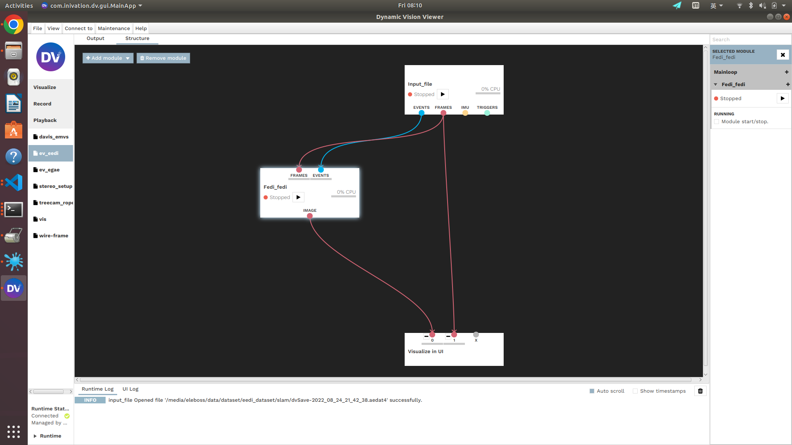

# Fast Event-based Double Integral for Real-time Robotics (Academic Use Only)
## [Paper](https://arxiv.org/abs/2305.05925) | [Video: Youtube](https://www.youtube.com/watch?v=xzrHNA97wls) | [Video: Bilibili](https://www.bilibili.com/video/BV1qL411X7hc/?share_source=copy_web&vd_source=2483c9488f1bd3f3478cf69bfca4d49e)

<sub>
Motion deblurring is a critical ill-posed problem that is important in many vision-based robotics applications. The recently proposed event-based double integral (EDI) provides a theoretical framework for solving the deblurring problem with the event camera and generating clear images at high frame-rate. However, the original EDI is mainly designed for offline computation and does not support real-time requirement in many robotics applications. In this paper, we propose the fast EDI, an efficient implementation of EDI that can achieve real-time online computation on single-core CPU devices, which is common for physical robotic platforms used in practice. In experiments, our method can handle event rates at as high as 13 million event per second in a wide variety of challenging lighting conditions. Its benefit has been demonstrated on multiple downstream real-time applications, including localization, visual tag detection, and feature matching.
</sub>

<!--  -->

## Understanding the hardware bias of event camera
[Tutorial of the bias](https://gitlab.com/inivation/inivation-docs/blob/master/Advanced%20configurations/User_guide_-_Biasing.md)
## Checking the hardware bias using the jAER
One can use the jAER project to get a roughly estimated contrast from the bias currents that are estimated to be generated by the on-chip bias generator bias current ratios:[jAER homepage](https://github.com/SensorsINI/jaer)


Discussion regarding the bias estimation:[discussion](https://groups.google.com/g/davis-users/c/68gp0zxTMUk/m/SpweyJKrDgAJ)


and the physical model that build to estimate the threshold:[Paper](https://ieeexplore.ieee.org/document/7962235/)


## Usage
Test env:
```
ubuntu 18.04 
dv-runtime 1.6.1 
dv-gui 1.6.0
```

1. download the DV and install it following the tutorial [DV install guide](https://inivation.gitlab.io/dv/dv-docs/docs/getting-started.html)
2. download the fast EDI code
```
git clone https://github.com/eleboss/fast_EDI
```
3. compile the fast EDI module
```
cd ./dv-module/fast-edi
cmake ./
make
```
then you will see the `fedi_FEDI.so`, this is the file you need to add to the dv-gui.

4. configure the DV-GUI search path
```
dv-gui
```
find the `structure - add modules - modify module search path - add path` (this path leads to `fedi_FEDI.so`, for me is `/home/eleboss/Documents/fast_EDI/dv-module/fast-edi`). Then you can add the fast edi modules to the dv-gui and wires it in this way:


5. download the test data [dataset](https://figshare.com/s/bfa74d5793a4af962b49), and play it. 

Performance tips: You can tune the contrast or use the jAER to estimate, or use EDI to optimize an accurate contrast.

## Citation
```
@article{lin2023fast,
  title={Fast Event-based Double Integral for Real-time Robotics},
  author={Lin, Shijie and Zhang, Yingqiang and Huang, Dongyue and Zhou, Bin and Luo, Xiaowei and Pan, Jia},
  booktitle={international conference on robotics and automation (ICRA)},
  year={2023},
  organization={IEEE}
}
```
